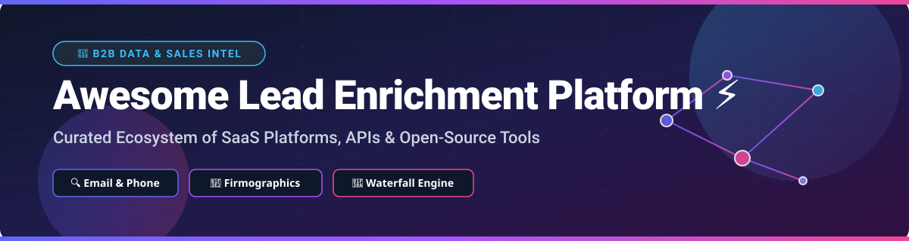

  

# 🚀 Awesome Lead Enrichment Platform ⚡

  
  
  
  
  

## 📌 Top Lead Enrichment Platforms & B2B Data Ecosystem

> **Curated List of SaaS Products & Open-Source GitHub Projects for Sales Intelligence, B2B Contact Data, Email Finding, Phone Enrichment, Firmographics & Waterfall Enrichment.**
>
> 🕒 *Last updated: September 2026*

---

### 💡 Overview & Market Landscape

This repository tracks notable **SaaS platforms**, **developer APIs**, and **open-source projects** for **Lead Enrichment**. These tools take partial lead or company records (such as domain, name, or LinkedIn URL) and automatically append verified emails, mobile phone numbers, job titles, firmographics, technographics, and intent signals to support sales, marketing, and recruiting workflows.

#### 📊 Market Size & Industry Structure
> 📈 **Estimated Market Size:** The global Lead Intelligence & B2B Data Enrichment Software market is estimated at **$3.8 Billion - $4.5 Billion (2026)**, growing at a CAGR of ~11.5%.
> 
> 🧩 **Market Fragmentation:** The sector is **moderately fragmented**. High-end enterprise database providers (e.g., ZoomInfo, HubSpot/Clearbit) hold significant market share, but rapid innovation in AI agents, automated waterfall orchestration (e.g., Clay), and niche GDPR-compliant regional providers prevents a "winner-take-all" monopoly.

**Open-source emphasis**: Full commercial B2B databases are proprietary. Practical open options exist as **self-hosted enrichment engines**, **email finders**, **waterfall toolkits**, and **public-data federators** (e.g., OpenLeads, FORGE/DataForge, Quick-Enrich suites). Coverage and accuracy are generally lower than paid databases; this section is honest about that trade-off.

Contributions welcome! Open a PR to add/update entries. Keep descriptions factual and link to official sites.

---

## 📑 Table of Contents

- [🏢 SaaS & Hosted Platforms](#-saas--hosted-platforms)
- [🔓 Open-Source GitHub Projects](#-open-source-github-projects)
- [🛠️ Frameworks & Best Practices](#%EF%B8%8F-frameworks--best-practices)
- [🤝 How to Contribute](#-how-to-contribute)
- [💖 Support & Sponsor](#-support--sponsor)
- [⚠️ Disclaimer](#%EF%B8%8F-disclaimer)
- [📈 Star History](#-star-history)

---

## 🏢 SaaS & Hosted Platforms

The B2B lead enrichment market contains enterprise database leaders as well as flexible API providers and waterfall orchestrators. Below is a curated list of top SaaS products ranked by company size (valuation / estimated annual revenue):

| 🏢 Platform | 📝 Description | 📊 Estimated Valuation / Revenue | 💵 Starting Tier Price | 🎁 Free Tier / Trial Limits |
| :--- | :--- | :--- | :--- | :--- |
| **[ZoomInfo](https://www.zoominfo.com/)** | Enterprise B2B database & intelligence platform with contact, intent & org-chart data. | **~$7.5B Valuation** (~$1.2B ARR) | $14,995 / year (Enterprise) | 14-day free trial (Limited sample credits) |
| **[HubSpot Breeze Intelligence (Clearbit)](https://www.hubspot.com/)** | Real-time company & person data enrichment integrated natively into HubSpot CRM. | **~$28B Valuation** (HubSpot Parent) | $50 / month (HubSpot Starter) | Free CRM tier with 100 enrichment credits/mo |
| **[Apollo.io](https://www.apollo.io/)** | All-in-one sales intelligence, B2B data, sequence automation & dialer platform. | **$1.6B Valuation** (~$100M+ ARR) | $49 / user / month | Free plan (10,000 email credits/mo + 60 export credits/yr) |
| **[Clay](https://www.clay.com/)** | Advanced enrichment orchestration platform running waterfalls across 50+ data providers. | **$1.3B Valuation** (~$50M+ ARR) | $149 / month (Starter) | Free plan (100 credits/month forever) |
| **[Cognism](https://www.cognism.com/)** | GDPR-compliant B2B data provider specializing in EMEA coverage & verified mobile numbers. | **~$500M Valuation** (~$50M ARR) | $1,500 / year (Grow tier) | 25 free credits upon request / trial demo |
| **[People Data Labs](https://www.peopledatalabs.com/)** | Developer API providing raw B2B person & company profile enrichment data. | **~$250M Valuation** (~$20M ARR) | $99 / month (Starter API) | Free plan (1,000 API calls/month forever) |
| **[Lusha](https://www.lusha.com/)** | Contact enrichment browser extension and B2B contact data platform. | **$1.5B Valuation** (~$75M ARR) | $36 / user / month (Pro) | Free plan (5 credits/month per user forever) |
| **[Hunter.io](https://hunter.io/)** | Domain email finder, pattern discoverer & email deliverability verification tool. | **~$100M Valuation** (~$15M ARR) | $34 / month (Starter) | Free plan (25 email searches + 50 verifications/mo) |
| **[Kaspr](https://www.kaspr.io/)** | LinkedIn-focused extension and instant lead enrichment app for phone numbers & emails. | **~$60M Valuation** (~$10M ARR) | $49 / user / month (Starter) | Free plan (5 phone credits + 5 email credits/mo) |
| **[Snov.io](https://snov.io/)** | Cold outreach, email finding, verification & drip campaign automation suite. | **~$40M Valuation** (~$8M ARR) | $30 / month (Starter) | Free plan (50 credits/month forever) |
| **[FullEnrich](https://fullenrich.com/)** | Multi-vendor waterfall enrichment engine for maximizing work email & mobile phone match rates. | **~$15M Valuation** (~$3M ARR) | $29 / month (Starter) | Free plan (50 enrichment credits upon signup) |
| **[Dropcontact](https://www.dropcontact.com/)** | Algorithmic, GDPR-compliant B2B email finder and CRM auto-cleaning solution. | **~$12M Valuation** (~$2M ARR) | €24 / month (Starter) | Free trial (100 free enrichment credits) |
| **[Datagma](https://datagma.com/)** | Web scraping & API-based B2B enrichment platform for contact & social data. | **~$5M Valuation** (~$1M ARR) | $39 / month (Discover) | Free plan (75 credits/month forever) |

---

## 🔓 Open-Source GitHub Projects

Self-hosted frameworks, open libraries, and developer tools for building custom data pipelines, local web scraping, and keyless lead finders. Ranked by GitHub Star Count (descending):

| 📦 Repository & Stars | 📝 Description | ⚡ Category |
| :--- | :--- | :--- |
| **[n8n](https://github.com/n8n-io/n8n)**  | Fair-code workflow automation tool with extensive lead enrichment & CRM integration nodes. | Workflow & Enrichment Orchestration |
| **[SearXNG](https://github.com/searxng/searxng)**  | Open-source privacy-respecting metasearch engine used to harvest public company & domain data. | Public Data Harvesting |
| **[Activepieces](https://github.com/Activepieces/activepieces)**  | Open-source no-code business automation tool with out-of-the-box enrichment & B2B integrations. | Workflow & Enrichment Automation |
| **[PhoneInfoga](https://github.com/sundowndev/phoneinfoga)**  | Advanced open-source information gathering & OSINT framework for phone number enrichment. | Phone Intelligence & OSINT |
| **[Mautic](https://github.com/mautic/mautic)**  | Open-source marketing automation platform with contact profile building & lead scoring capabilities. | Open CRM & Lead Management |
| **[AfterShip Email Verifier](https://github.com/aftership/email-verifier)**  | Go library for email verification without sending emails (checks MX, SMTP, syntax & disposable domains). | Email Verification Engine |
| **[DataForge (FORGE)](https://github.com/Nuclear-Marmalade/dataforge)**  | Open-source business enrichment engine appending tech stacks, emails & firmographics via local AI. | Self-Hosted AI Enrichment |
| **[People Data Labs Python SDK](https://github.com/peopledatalabs/peopledatalabs-python)**  | Official Python SDK client wrapper for People Data Labs person and company enrichment APIs. | Developer API Client |
| **[OpenLeads](https://github.com/Samyrrrrrr990/openleads)**  | Keyless, open-source lead finder federating public sources (OSM, YC, Wikidata, GitHub) locally. | Keyless Public Lead Finder |
| **[Quick-Enrich Tools](https://github.com/mattvinall/Quick-Enrich-Tools)**  | Suite of self-hostable tools for company discovery, Maps-based leads, funded startups & people intel. | Self-Hosted Lead Toolkit |

---

## 🛠️ Frameworks & Best Practices

- **Self-Hosted Keyless Enrichment**: Use **OpenLeads** or **DataForge** when you want fully local, keyless enrichment from public web data without API monthly subscriptions.
- **Custom Waterfall Pipelines**: Build multi-stage waterfall pipelines combining open CLIs with selective paid APIs (Hunter, PDL, Clay) to maximize match rates while minimizing cost.
- **Hybrid Stack Strategy**: Combine open company discovery (Google Maps, OpenStreetMap, SEC filings) with commercial email verification and mobile phone lookup engines.
- **Enterprise Trade-offs**: Large, continuously updated B2B databases, verified direct dials, intent data, and enterprise SLAs still require commercial SaaS platforms (ZoomInfo, Apollo, Cognism, Clay, Lusha).
- **Compliance & Ethics**: Focus open-source efforts on transparency, strict GDPR/CCPA compliance, and responsible public-data utilization.

---

## 🤝 How to Contribute

1. 🍴 Fork the repo.
2. 📝 Add/edit entries in `README.md` (follow existing tabular and markdown formatting).
3. 🔍 Include: Name, link, description, pricing/star metrics, and correct category placement.
4. 🚀 Submit a Pull Request with a descriptive title.

*⭐ Star the repo if you find this ecosystem breakdown useful!*

---

## 💖 Support & Sponsor

Thank you for exploring the **Awesome Lead Enrichment Platform** ecosystem repository! If you found this list helpful, please consider supporting the project:

- 🌟 **Star this repository** on GitHub to help others discover it.
- 🍴 **Fork it** to customize your own lead enrichment pipeline tooling.
- 📢 **Share it** with fellow sales ops, growth engineers, and developers.
- ☕ **Buy me a coffee**: Support ongoing maintenance and open-source updates via the [GitHub Sponsor Dashboard](https://github.com/sponsors/ishandutta2007).

---

## ⚠️ Disclaimer

- This repository is a **community-curated** educational guide — not exhaustive and not an endorsement of listed vendors.
- Lead enrichment involves personal data and is subject to GDPR, CCPA, CAN-SPAM, and regional privacy regulations. Bulk email collection and web scraping must comply with platform terms of service and applicable laws. Always maintain a lawful basis for processing. This list does not constitute legal advice.

---

## 📈 Star History

---

  <b>Made with ❤️ for Sales Ops, GTM Engineers, and Growth Developers.</b>

